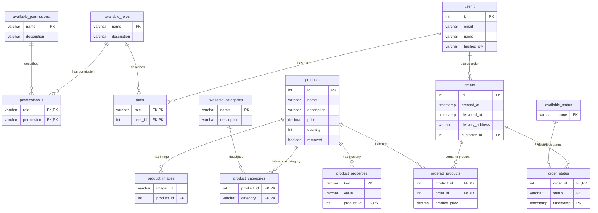

# hi1031lab1

Det här repot är skapat för labb 1 i kursen HI1031 och är byggt med hjälp av Java Enterprise (Jakarta) och trelagersarkitektur med MVC. Applikationen hanterar produkter, användare (med olika roller) och beställningar genom en tydligt separerad arkitektur där logik, dataåtkomst och användargränsnitt hålls åtskilda.

## Köra applikationen

Om du har [`docker`](https://docker.com/) installerat kan du köra applikationen genom att klona repot och sedan använda docker compose för att köra igång tomcatservern och dbn.

```bash
git clone https://github.com/Phillezi/hi1031lab1.git && \
cd hi1031lab1 && \
docker compose up
```

Webbshoppen nås då på [`localhost:8080`](http://localhost:8080).

## UML diagram

TODO:


## DB


