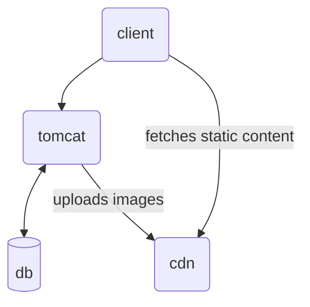
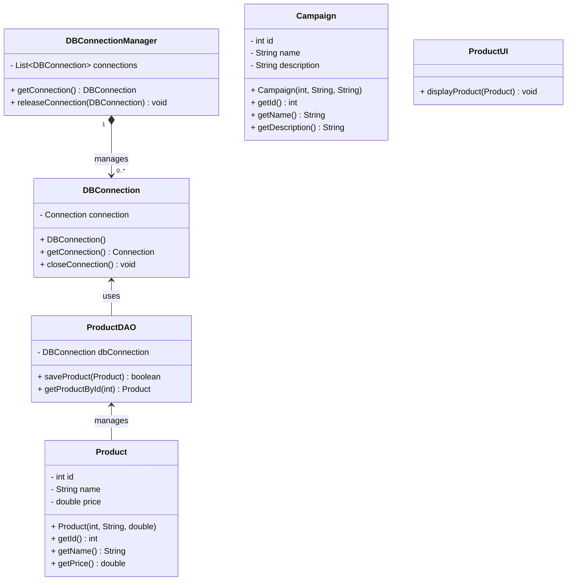
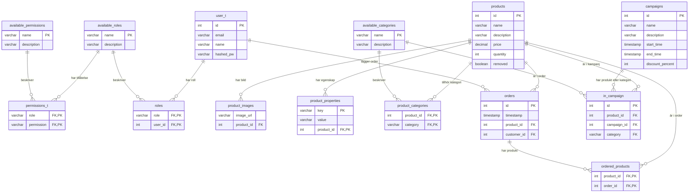

# hi1031lab1

## Innehållsförteckning

## Översikt

Repo för labb 1 i HI1031 med java enterprise.

```mermaid
graph
    client(client) --> tomcat(tomcat) <--> db[(db)]
    client -->|fetches static content| cdn(cdn)
    tomcat -->|uploads images| cdn
```

## UML diagram

TODO:

```mermaid
classDiagram
    class DBConnection {
        - Connection connection
        + DBConnection()
        + getConnection() Connection
        + closeConnection() void
    }

    class DBConnectionManager {
        - List~DBConnection~ connections
        + getConnection() DBConnection
        + releaseConnection(DBConnection) void
    }

    class Campaign {
        - int id
        - String name
        - String description
        + Campaign(int, String, String)
        + getId() int
        + getName() String
        + getDescription() String
    }

    class Product {
        - int id
        - String name
        - double price
        + Product(int, String, double)
        + getId() int
        + getName() String
        + getPrice() double
    }

    class ProductDAO {
        - DBConnection dbConnection
        + saveProduct(Product) boolean
        + getProductById(int) Product
    }

    class ProductUI {
        + displayProduct(Product) void
    }

    DBConnectionManager "1" *--> "0..*" DBConnection : manages
    DBConnection <-- ProductDAO : uses
    ProductDAO <-- Product : manages

```

## ER diagram

```mermaid
erDiagram
    user_t {
        int id PK
        varchar email
        varchar name
        varchar hashed_pw
    }

    available_permissions {
        varchar name PK
        varchar description
    }

    available_roles {
        varchar name PK
        varchar description
    }

    permissions_t {
        varchar role FK, PK
        varchar permission FK, PK
    }

    roles {
        varchar role FK, PK
        int user_id FK, PK
    }

    available_categories {
        varchar name PK
        varchar description
    }

    products {
        int id PK
        varchar name
        varchar description
        decimal price
        int quantity
        boolean removed
    }

    product_images {
        varchar image_url
        int product_id FK
    }

    product_properties {
        varchar key PK
        varchar value
        int product_id FK, PK
    }

    product_categories {
        int product_id FK, PK
        varchar category FK, PK
    }

    orders {
        int id PK
        timestamp timestamp
        int product_id FK
        int customer_id FK
    }

    ordered_products {
        int product_id FK, PK
        int order_id FK, PK
    }

    campaigns {
        int id PK
        varchar name
        varchar description
        timestamp start_time
        timestamp end_time
        int discount_percent
    }

    in_campaign {
        int id PK
        int product_id FK
        int campaign_id FK
        varchar category FK
    }

    user_t ||--o{ roles : "har roll"
    available_roles ||--o{ roles : "beskriver"
    available_roles ||--o{ permissions_t : "har tillåtelse"
    available_permissions ||--o{ permissions_t : "beskriver"
    products ||--o{ product_images : "har bild"
    products ||--o{ product_properties : "har egenskap"
    products ||--o{ product_categories : "tillhör kategori"
    available_categories ||--o{ product_categories : "beskriver"
    products ||--o{ orders : "är i order"
    user_t ||--o{ orders : "lägger order"
    products ||--o{ ordered_products : "är i order"
    orders ||--o{ ordered_products : "har produkt"
    products ||--o{ in_campaign : "är i kampanj"
    campaigns ||--o{ in_campaign : "har produkt eller kategori"
    available_categories ||--o{ in_campaign : "är i kampanj"

```
